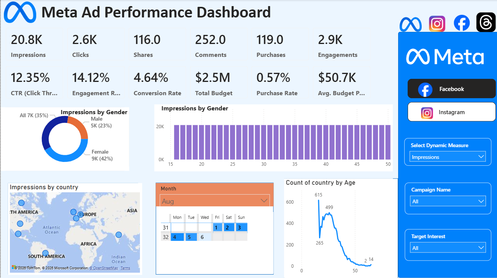
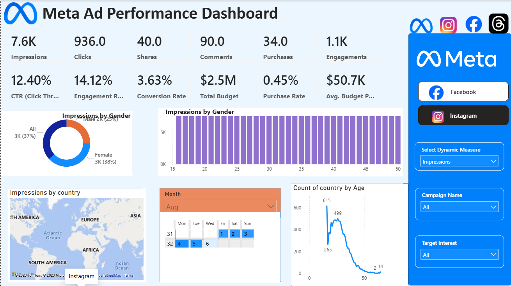

# 📢 Meta Ads Performance Dashboard

  

  
  
  
  

---

## 📖 Project Overview

The **Meta Ads Performance Dashboard** is an interactive Business Intelligence solution developed in **Power BI**. It transforms raw Facebook and Instagram advertising data into meaningful insights, enabling marketers and businesses to analyze campaign performance, audience engagement, conversions, and budget utilization through dynamic visualizations.

This dashboard helps stakeholders make informed marketing decisions by providing a clear and comprehensive view of advertising performance.

---

## 🎯 Objectives

* Analyze advertising campaign performance.
* Monitor audience engagement metrics.
* Track conversions and purchases.
* Evaluate campaign budget effectiveness.
* Identify high-performing audience segments.
* Support data-driven marketing decisions.

---

## ✨ Key Features

### 📌 KPI Cards

* Total Impressions
* Total Clicks
* Total Shares
* Total Comments
* Total Purchases
* Total Engagements
* Click Through Rate (CTR)
* Engagement Rate
* Conversion Rate
* Total Budget
* Purchase Rate
* Average Campaign Budget

### 📊 Interactive Visualizations

* Campaign Performance Analysis
* Audience Demographics Insights
* Gender-wise Impression Analysis
* Geographic Reach Analysis
* Conversion Tracking
* Engagement Monitoring
* Dynamic Filters and Slicers

---

## 📷 Dashboard Preview

<table>
<tr>
<td align="center">
<b>📊 Meta Ad Performance Dashboard</b>  

</td>

<td align="center">
<b>📊 Meta Ad Performance Dashboard</b>  

</td>
</tr>
</table>

---

## 🛠️ Tools & Technologies

| Technology  | Purpose                        |
| ----------- | ------------------------------ |
| Power BI    | Data Visualization & Reporting |
| Power Query | Data Cleaning & Transformation |
| DAX         | Data Modeling & Measures       |
| Excel / CSV | Data Source                    |
| Bing Maps   | Geographic Analysis            |

---

## 📈 Business Insights

✔ Track overall campaign performance

✔ Monitor audience engagement trends

✔ Analyze conversion effectiveness

✔ Evaluate advertising budget utilization

✔ Identify top-performing demographics

✔ Understand geographic reach and impact

✔ Support strategic marketing decisions

---

## 🚀 Dashboard Highlights

* Modern and Interactive Design
* User-Friendly Navigation
* Dynamic Filtering Capabilities
* Professional KPI Tracking
* Actionable Marketing Insights
* Clean and Responsive Layout

---

## 🔮 Future Enhancements

* ROAS (Return on Ad Spend) Analysis
* Cost Per Click (CPC) Tracking
* Cost Per Acquisition (CPA) Analysis
* Real-Time Data Integration
* Predictive Analytics
* AI-Based Marketing Recommendations

---

  <b>📢 Turning Meta Advertising Data into Actionable Marketing Insights 📊</b>

